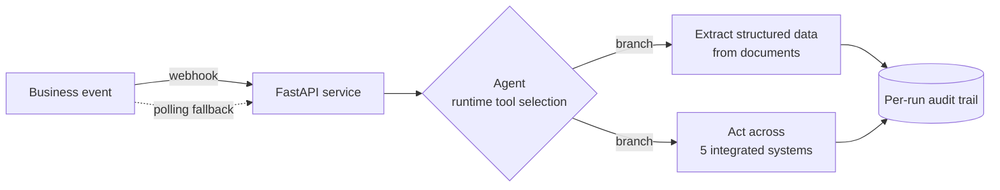
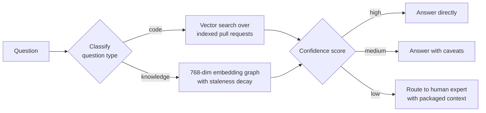
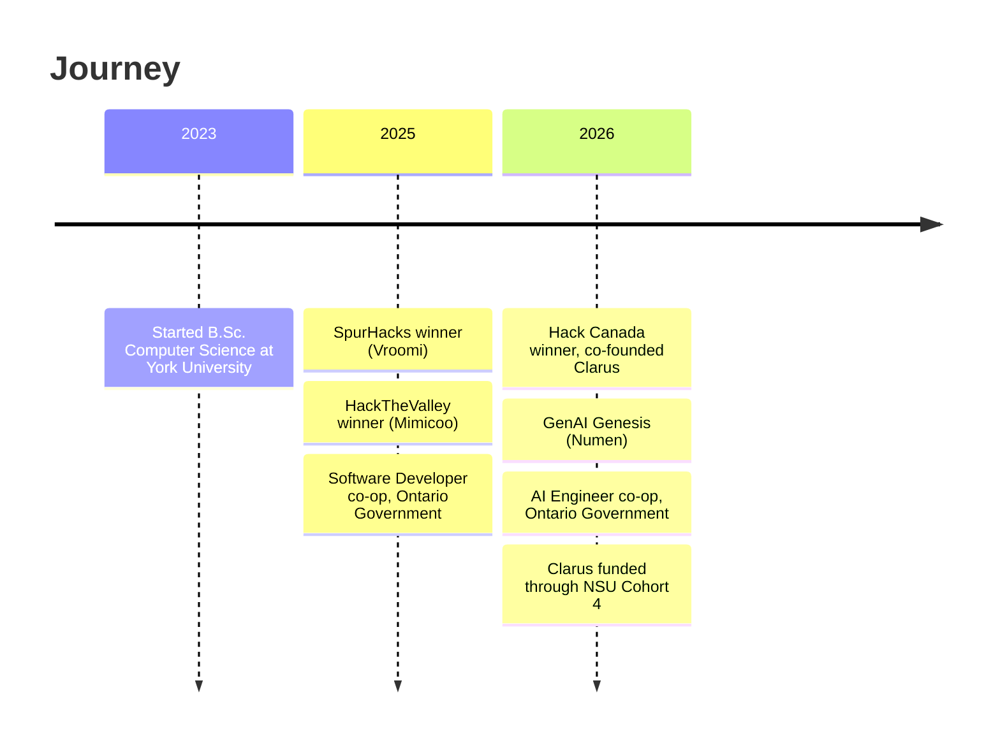

 

 

---

## About Me

I'm a Computer Science student at **York University** who likes the unglamorous half of AI: making it fast, measurable, and trustworthy once real users depend on it.

- Co-founding **[Clarus](https://devpost.com/software/clarus-7werym)**, an AI workflow automation startup that won **Hack Canada 2026** and is now funded through **NSU Cohort 4**
- Previously **AI Engineer** and **Software Developer** co-op at the **Ontario Government**
- Looking for **Spring / Fall 2027 internships** and **new grad** roles in AI, backend, and full-stack engineering

---

## Impact at a Glance

| Metric | Where |
|:---|:---|
| **35%** lower inference latency on a production RAG system | Ontario Government, AI Engineer |
| **33%** faster incident response through monitoring and alerting | Ontario Government, Software Developer |
| **30 datasets** from **20 systems** consolidated into one data layer | Ontario Government, Software Developer |
| **60%+** of questions answered automatically by a multi-agent system | Numen, GenAI Genesis 2026 |
| **5 systems**, **0 manual handoffs** in an automated AI workflow | Clarus, Hack Canada 2026 Winner |
| **85%** classifier accuracy with **30%** faster inference | Mimicoo, HackTheValley 2025 Winner |

---

## Featured Projects

### [Clarus](https://devpost.com/software/clarus-7werym) &nbsp;  

A production **AI agent** that automates a business workflow end to end across five integrated systems.

- Runtime **tool selection** and conditional branching, taken from prototype to production
- Added a **polling fallback** after diagnosing a silent webhook failure, so no event is lost
- Every agent action is logged to a **per-run audit trail** for reliability review

---

### [Numen](https://devpost.com/software/numen-9l43wx) &nbsp; 

A **multi-agent** knowledge platform that answers engineering and sales questions, and knows when *not* to answer.

- **60%+ auto-answer rate** across engineering, sales, and custom agents
- **Hybrid search** routes each question to the retrieval path that fits it
- **Confidence gating** keeps uncertain answers away from users

---

<table>
<tr>
<td width="33%" valign="top">

### [Vroomi](https://devpost.com/software/vroomi)

Full-stack web app with third-party **REST API** and **Stripe** payment integrations, deployed to production.

</td>
<td width="33%" valign="top">

### [Mimicoo](https://devpost.com/software/mimicoo)

Feature-engineered classifier trained to **85% accuracy**, served from a Python inference API with **30%** faster inference.

</td>
<td width="33%" valign="top">

### [Troupe](https://troupeapp.vercel.app/)

Android app with feeds, matching, and media uploads on a **Spring Boot REST** back end, with **Redis** caching and rate limiting.

</td>
</tr>
</table>

---

## Experience

**AI Engineer, Co-op** &nbsp;·&nbsp; Ontario Government &nbsp;·&nbsp; *May 2026 – Aug 2026*
Shipped a production **RAG application** over 20 curriculum documents with **LangChain** and **Pinecone**, and cut inference latency **35%** through chunk tuning and embedding caching.

**Software Developer, Co-op** &nbsp;·&nbsp; Ontario Government &nbsp;·&nbsp; *Sept 2025 – May 2026*
Built **Python** pipelines and **REST APIs** consolidating **30 datasets from 20 systems**, deployed on **AWS** with **Docker** and **CI/CD**, and built monitoring that cut incident response **33%**.

---

## Tech Stack

**AI & Machine Learning**
 

**Languages**
 

**Frameworks**
 

**Data & Infrastructure**
 

---

## GitHub Activity

