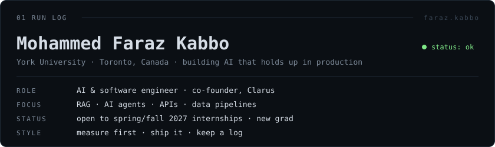
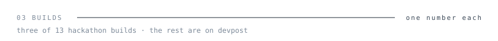
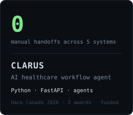
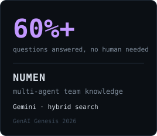
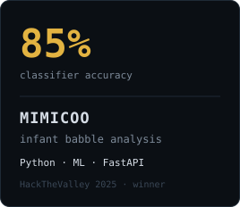

  

  <a href="https://www.linkedin.com/in/mohammed-faraz-kabbo/"><b>LINKEDIN</b></a>
  &nbsp;&nbsp;·&nbsp;&nbsp;
  <a href="https://farazkabbo.github.io/Portfolio/"><b>PORTFOLIO</b></a>
  &nbsp;&nbsp;·&nbsp;&nbsp;
  <a href="https://devpost.com/farazkabbo"><b>DEVPOST</b></a>
  &nbsp;&nbsp;·&nbsp;&nbsp;
  <a href="mailto:faraz18@my.yorku.ca"><b>EMAIL</b></a>

  

  

  
  
  

